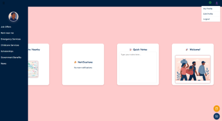
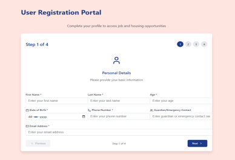

# 🌍 Migrant Connect Web App

A secure, decentralized digital identity platform for interstate migrants — developed as a **React + Node.js web app** for the **Infosys Global Hackathon (July 11–12, 2024)** by **Team Rocket**.

---

## 📌 Overview

This is the **web version** of the Migrant Connect platform, designed to provide essential services for migrants moving across Indian states. It enables **identity verification**, **document management**, and access to **basic services** — all through a simple and secure web interface.

While the mobile version includes advanced features like **multilingual support**, **voice assistant**, and **job/accommodation listings**, this web app focuses on delivering core functionalities like secure login, document upload, and access to maps and calendar.

---

## 🖼️ Web App Preview

### Dashboard  

### Registration Flow  

> _To include these screenshots, save them as `dashboard.png` and `registration.png` inside a folder named `assets/` in the repo._

---

## 🔑 Key Features (Web)

- ✉️ **Email + OTP Login** via [Magic SDK](https://magic.link/)
- 📄 **Aadhaar-based registration**
- 📁 **Document uploads** securely handled via Multer and stored on [IPFS](https://www.pinata.cloud/) using Pinata
- 🗺️ Integrated **Google Maps**
- 📆 Access to **Google Calendar**
- 📝 Quick Notes and user profile management

---

## 🛠 Tech Stack

### Frontend
- **React.js**
- **Magic SDK** for passwordless login
- Google Maps API
- Google Calendar Embed

### Backend
- **Node.js**
- **Express.js**
- **CORS**
- **Multer** for file uploads
- **Axios** for HTTP requests to Pinata IPFS

---

## 📱 Mobile App Comparison

The **mobile version** (built with Flutter) includes all of the web features **plus**:

- 🗣️ **Multilingual support** (covers major Indian languages)
- 🧠 **Voice Assistant** (speech-to-text + text-to-speech)
- 💼 **Job Listings**: Employers can post, and users can accept jobs
- 🏠 **Accommodation Discovery**
- 🆘 Access to **emergency service contacts**
- 📜 **Law & policy updates** tailored to user location
- 🌐 **Smart Document Translator** (supports scanned docs, images, and text)

---

